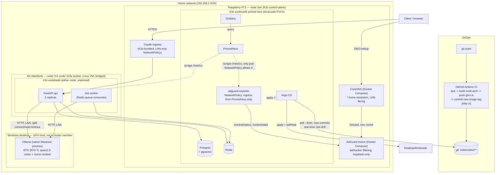

# Homelab Cloud + AI Platform

A self-hosted cloud/AI platform built across a Raspberry Pi 5 and a GPU-equipped
Windows desktop, demonstrating production-style backend, infrastructure, and
MLOps practices: Linux administration, Docker/Kubernetes, FastAPI, PostgreSQL +
pgvector, Redis, local LLM inference (RAG), CI/CD, GitOps, and observability.

All 18 roadmap steps below are complete. Every phase is documented under
[docs/](docs/) with what was actually built, real bugs found while
building it, and verification evidence - not just "it worked."

## Notable engineering decisions & incidents

The parts most worth a closer look, pulled up from their individual docs:

- **A security gap that only showed up under real traffic, not config
  review**: `ufw`'s LAN-only rules never actually applied to Kubernetes
  traffic - kube-router's own iptables chains processed *before* ufw's in
  the `INPUT` chain, silently bypassing every rule. Found by testing from
  a pod deliberately outside the allowed CIDR, not by reading the
  ruleset. Fixed with `externalTrafficPolicy: Local` + a `NetworkPolicy`,
  verified with a real blocked-vs-allowed traffic test.
  [docs/kubernetes.md](docs/kubernetes.md) - [docs/argocd.md](docs/argocd.md)
- **A GitOps ordering mistake that cascaded into an unrelated networking
  bug**: rotating a credential out of order let Argo CD's `selfHeal`
  revert it, which blocked a sync, which meant pods kept getting
  scheduled onto a WSL2 worker node with a separate, genuine networking
  defect - Windows was silently dropping flannel's VXLAN overlay traffic
  despite every firewall layer being correctly configured. Fixed by
  switching K3s to a `host-gw` backend. Two real incidents, root-caused
  independently, not conflated. [docs/secrets.md](docs/secrets.md) -
  [docs/kubernetes.md](docs/kubernetes.md)
- **A failure-testing pass that found a real bug instead of just
  confirming resilience**: a dead Ollama backend hung API requests for
  minutes instead of failing fast, because a single blanket `httpx`
  timeout covered both "connect" and "wait for slow generation." Found,
  root-caused from the actual retry/timeout code, fixed, and re-verified
  live against the deployed fix (hang eliminated: >180s unresolved to a
  clean 18s failure). [docs/failure-testing.md](docs/failure-testing.md)
- **Load and failure testing backed by server-side evidence, not just
  client-side tool output**: k6 results cross-checked against
  Prometheus/Grafana (CPU headroom, memory-over-time, real request
  rate); a rate limiter verified to trigger at exactly the correct
  request under a real burst; Postgres data confirmed to survive a pod
  restart by querying the same document before and after, not just
  checking the pod came back healthy.
  [docs/load-testing.md](docs/load-testing.md) -
  [docs/failure-testing.md](docs/failure-testing.md)
- **A stock default that is only wrong at scale**: AdGuard Home's
  `ratelimit` is per client IP, and CoreDNS forwards every query to it
  from `127.0.0.1` - so the whole LAN shares one 20 qps bucket. Harmless
  with two devices pointed at the Pi; a total DNS outage the moment DHCP
  pointed every phone and TV there too, with dropped queries surfacing as
  timeouts rather than errors. Found by reading the forwarder's own
  config after the symptom made no sense, and verified fixed with a
  120-query concurrent burst rather than by re-reading the setting.
  [docs/router-migration.md](docs/router-migration.md)

## Architecture

Current state - see [diagrams/architecture.md](diagrams/architecture.md)
for the same diagram plus notes on what it intentionally leaves out.



## Hardware

| Node | Role |
|---|---|
| Raspberry Pi 5 (NVMe) | K3s control-plane, DNS, Postgres, Redis, Argo CD, Prometheus/Grafana |
| M1 MacBook Pro (16GB) | K3s worker, Ubuntu 24.04 arm64 in a bridged VM |
| Desktop (i7-14700K, RTX 3070 Ti 8GB, 32GB RAM) | GPU host for Ollama. Not a cluster member - see [docs/node-migration.md](docs/node-migration.md) |

## Status

Milestone 1 complete — see [docs/milestone-1.md](docs/milestone-1.md).
Backend feature list (auth, rate limiting, caching, retries, metrics,
jobs, embeddings) complete — see [docs/backend.md](docs/backend.md).
RAG pipeline complete — see [docs/rag.md](docs/rag.md).
Prometheus + Grafana deployed — see [docs/monitoring.md](docs/monitoring.md).
Migrated onto a multi-node K3s cluster (Pi + desktop via WSL2) — backend,
data, ai, and monitoring namespaces all live, old Docker Compose stacks
decommissioned — see [docs/kubernetes.md](docs/kubernetes.md).
CI/CD live — GitHub Actions tests, builds, and pushes to ghcr.io on push
— see [docs/cicd.md](docs/cicd.md).
Argo CD live — git is now the actual source of truth for the cluster,
CI commits new image tags instead of deploying directly, with a real
network security fix along the way (ufw's LAN-only rules never applied
to K3s) — see [docs/argocd.md](docs/argocd.md).
Pi host setup codified in Ansible — six roles, three real bugs found and
fixed by actually running it, verified idempotent (a second real run
reports zero changes) — see [docs/ansible.md](docs/ansible.md).
GitHub repo settings managed via Terraform (import, not create) — see
[docs/terraform.md](docs/terraform.md).
Secrets encrypted at rest with SOPS + age, out of Argo CD's sync path —
a real incident along the way (a rotation-ordering mistake that cascaded
into an unrelated flannel VXLAN bug on the WSL2 worker node) — see
[docs/secrets.md](docs/secrets.md) and
[docs/kubernetes.md](docs/kubernetes.md).
Load tested with k6 — 0% errors at ~480 req/s sustained over a 5.5-minute
soak, rate limiter verified to trigger at exactly the right request, no
memory growth under sustained load — see
[docs/load-testing.md](docs/load-testing.md).
Failure tested — zero-downtime pod kills, Postgres data confirmed to
survive a pod restart, Argo CD self-heals live drift in ~11s (much
faster than its ~3min git-polling interval), and a real gap found (and
fixed) in the Ollama retry/timeout logic — a dead backend used to hang
a request past 180s unresolved, now fails in ~18s with the correct
502 — see [docs/failure-testing.md](docs/failure-testing.md).
Router replaced (Spectrum SAX1V1S -> a model that supports DHCP
reservations and DHCP DNS override), which stranded a headless Pi behind
its own correctly-configured firewall and surfaced a stock AdGuard
default that only fails once the whole LAN is behind it - see
[docs/router-migration.md](docs/router-migration.md).
Second node moved off WSL2 to a Linux VM on an M1 MacBook, and the
Windows desktop left the cluster to be a GPU host only - which retired
the whole class of WSL2 mirrored-networking failures, both Scheduled
Task workarounds, and the `linux/amd64` half of every image build - see
[docs/node-migration.md](docs/node-migration.md).

## Repo structure

```
homelab/
├── apps/
│   ├── api/              # FastAPI backend service (deployed to K8s)
│   └── ai/                # placeholder - RAG lives in apps/api, see docs/kubernetes.md
├── kubernetes/            # K3s manifests (ai/backend/data/monitoring namespaces, Argo CD)
├── kubernetes/secrets/    # SOPS-encrypted Secrets, applied out-of-band - see docs/secrets.md
├── docker/                # dns/ still live; docker-compose.yml + monitoring/ retired - see docker/README.md
├── ansible/               # Pi host configuration automation
├── terraform/             # GitHub repo settings as code
├── load-testing/          # k6 scripts - see docs/load-testing.md
├── failure-testing/        # Fault-injection scripts - see docs/failure-testing.md
├── apps/dashboard/          # Status UI + GPU release trigger, runs in-cluster - see docs/dashboard.md
├── backup/                 # Encrypted backup + restore-rehearsal tooling - see docs/backups.md
├── scripts/                # Small host utilities (e.g. the deployed-auth verifier)
├── diagrams/               # Architecture diagram
└── docs/                   # Per-phase logs: what was built, bugs found, verification
```

## Roadmap

1. ✅ Linux/server setup
2. ✅ Networking
3. ✅ Docker
4. ✅ Private DNS
5. ✅ FastAPI
6. ✅ PostgreSQL + Redis
7. ✅ Ollama/GPU inference
8. ✅ RAG
9. ✅ Prometheus + Grafana
10. ✅ Kubernetes/K3s
11. ✅ CI/CD
12. ✅ Argo CD
13. ✅ Ansible
14. ✅ Terraform
15. ✅ Security
16. ✅ Load testing
17. ✅ Failure testing
18. ✅ Documentation
