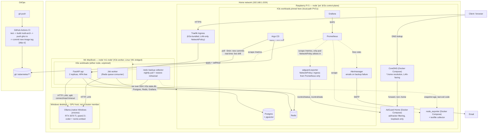

# Architecture

Current state as of the Kubernetes migration ([docs/kubernetes.md](../docs/kubernetes.md))
onward - not the original target sketch in the top-level README, which
predates the K3s decision. See [docs/milestone-1.md](../docs/milestone-1.md)
for the pre-Kubernetes Docker Compose architecture this replaced.

## Notes on what this diagram intentionally omits

- **Secrets** (`docs/secrets.md`) - SOPS-encrypted, applied out-of-band,
  deliberately outside Argo CD's sync path. Not drawn as a GitOps-managed
  resource because it isn't one.
- **The flannel pod-network layer** underneath the two K3s nodes
  (`docs/kubernetes.md`) - currently the `wireguard-native` backend,
  after `vxlan` and then `host-gw` each turned out to be incompatible
  with WSL2 mirrored networking in a different way. This diagram shows
  the workload topology, not the pod-network internals that made
  cross-node traffic actually work.
- **ufw** on the Pi, scoping every inbound port to the LAN - see
  `docs/kubernetes.md` and `docs/argocd.md` for the real gap found and
  fixed there (kube-router's own iptables chains processed before ufw's).
